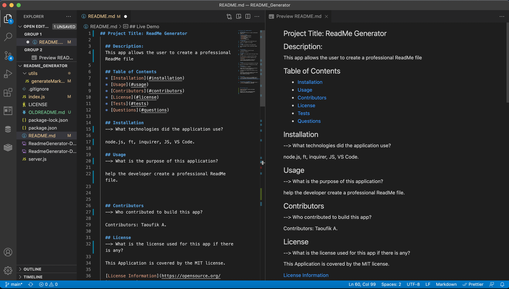

## Project Title: ReadMe Generator

  ## Description:
  This app allows the user to create a professional ReadMe file

  ## Table of Contents
  * [Installation](#installation)
  * [Usage](#usage)
  * [Contributors](#contributors)
  * [License](#license)
  * [Tests](#tests)
  * [Questions](#questions)
  
  ## Installation
  --> What technologies did the application use? 

  node.js, ft, inquirer, JS, VS Code.

  ## Usage
  --> What is the purpose of this application? 

  help the developer create a professional ReadMe file.

  ## Contributors
  --> Who contributed to build this app?

  Contributors: Taoufik A.

  ## License
  --> What is the license used for this app if there is any?

  This Application is covered by the MIT license.

  [License Information](https://opensource.org/licenses/MIT)

  

  ## Tests
  --> How do you test the functionality of this app?

 using the link provided or watching the live demo.

  ## Questions
  --> Any questions or feedback?

  Please reach out to me if you have any questions. Contact me at: toufikaminew@gmail.com

  --> Do you like to explore more projects for the developer?

  Interested in seeing other projects I have worked on? My repository can be accessed here: 
  https://github.com/lbladma

  ## Live Demo
  -- This is the Live Demo for the README Project --
  [Live URL](https://www.awesomescreenshot.com/video/5803086?key=741af992c1e1691f4cf838dc7697ea09)

  ## Screenshot of the README File
  -- This is the Screenshot of  the README Project --
  

  ## Live Project Links

  [Github Repo](https://github.com/lbladma/README_Generator)

  Deployed Link: https://github.com/lbladma/README_Generator/blob/main/README.md

  